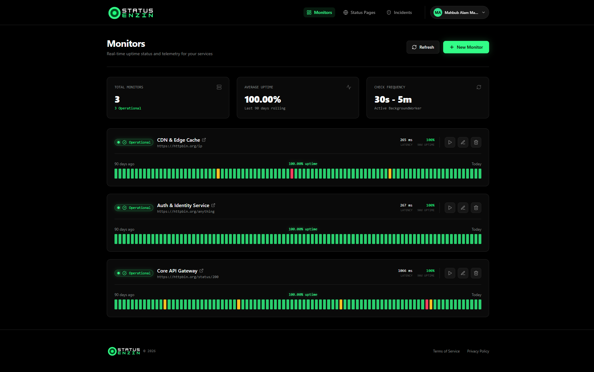

# StatusEnzin

Multi-tenant SaaS uptime monitoring and public status page platform. Monitor HTTP/HTTPS endpoints, publish branded status pages, manage incidents, and notify subscribers — with per-tenant isolation and Stripe-based billing.



---

## Features

- **Automated HTTP/HTTPS monitoring** — background checks at configurable intervals (30s–5min) tracking status code, latency, and rolling uptime %, enforced per plan tier
- **Public status pages** — publicly viewable portals with live auto-refresh, uptime bar graphs, incident timelines, and email subscriber opt-in
- **Incident management** — lifecycle tracking (Investigating → Identified → Monitoring → Resolved) with subscriber email notifications
- **Multi-tenant isolation** — EF Core global query filters scoping all entity queries to `TenantId`
- **Stripe billing** — 3 tiers (Starter/Free, Pro/$15, Business/$49) with per-plan monitor and status page limits, coupon codes, prorated upgrades, and embedded Stripe Elements checkout
- **Email queue** — background processor for double opt-in confirmations and incident alerts via Resend
- **Platform admin panel** — tenant management and system-wide view for super admins

## Tech Stack

| Layer    | Technology                                                              |
| -------- | ----------------------------------------------------------------------- |
| Backend  | .NET 10 Web API, EF Core + Npgsql, ASP.NET Core Identity + JWT         |
| Frontend | Next.js 15 (App Router), React 19, Tailwind CSS, Stripe Elements       |
| Database | PostgreSQL 16                                                           |
| Email    | Resend                                                                  |
| Billing  | Stripe.net                                                              |
| Deploy   | Docker (3 containers: db, api, web)                                     |

## Repository Structure

```
statusenzin/
├── .env.example              # root env template (used by docker compose)
├── .gitignore
├── docker-compose.yml        # 3-container setup for dev & prod
├── LICENSE                   # MIT
├── README.md
│
├── backend/
│   └── StatusEnzin.Api/
│       ├── .dockerignore
│       ├── .env.example      # local dev env template (no Docker)
│       ├── Dockerfile
│       ├── Program.cs
│       ├── StatusEnzin.Api.csproj
│       ├── Controllers/
│       ├── Data/
│       ├── DTOs/
│       ├── EmailTemplates/
│       ├── Migrations/
│       ├── Models/
│       ├── Properties/
│       └── Services/
│
└── frontend/
    ├── .dockerignore
    ├── .env.example          # local dev env template (no Docker)
    ├── Dockerfile
    ├── next.config.js
    ├── package.json
    ├── postcss.config.js
    ├── tailwind.config.js
    ├── tsconfig.json
    ├── app/
    ├── components/
    ├── lib/
    └── public/
```

---

## Quick Start (Docker)

Everything runs in Docker — no need to install .NET, Node.js, or PostgreSQL on your machine.

### Prerequisites

Install **Docker Desktop** from [docker.com](https://docker.com). Verify it's running:

```bash
docker --version
docker compose version
```

### Step 1 — Create Your Environment File

From the **project root** (where `docker-compose.yml` lives):

```bash
cp .env.example .env
```

Open `.env` in your editor. You **must** fill in these values:

```env
# Pick any strong password
DB_PASSWORD=CHANGE_ME_TO_A_STRONG_PASSWORD

# Generate a secure key:
#   Linux/macOS:  openssl rand -hex 32
#   PowerShell:   -join ((1..64) | ForEach-Object { '{0:X}' -f (Get-Random -Max 16) })
JWT_KEY=CHANGE_ME_TO_A_LONG_RANDOM_STRING

# The super admin account auto-created on first boot
ADMIN_EMAIL=admin@yourdomain.com
ADMIN_PASSWORD=CHANGE_ME
```

Everything else has sane defaults. Optional quick wins:

```env
# Stripe — leave empty to use mock mode (no real charges)
STRIPE_SECRET_KEY=

# Resend — leave empty to log emails to console instead of sending
RESEND_API_KEY=

# Seed demo content (Acme status page + monitors + incidents)
SEED_DEMO_DATA=true
```

### Step 2 — Start Everything

```bash
docker compose up -d
```

First run takes a few minutes to download images and build. Check that all services are healthy:

```bash
docker compose ps
```

You should see all three with `(healthy)` status:

```
NAME      STATUS          PORTS
db        running (healthy)
api       running (healthy)   0.0.0.0:8080->8080/tcp
web       running (healthy)   0.0.0.0:3000->3000/tcp
```

### Step 3 — Access the App

| What | URL |
|------|-----|
| **Frontend** | http://localhost:3000 |
| **API health check** | http://localhost:8080/health |
| **API base** | http://localhost:8080/api |

| What | URL | How |
|------|-----|-----|
| Landing page | http://localhost:3000 | — |
| Sign up | http://localhost:3000/signup | Create a new organization |
| Login | http://localhost:3000/login | Use the admin credentials from your `.env` |
| Dashboard | http://localhost:3000/dashboard | After login |
| Public status page | http://localhost:3000/status/acme | Only if `SEED_DEMO_DATA=true` |

> Change `ADMIN_PASSWORD` before sharing or deploying publicly.

---

## Docker Compose Architecture

```
┌─────────────────────────────────────────────────┐
│                  Docker Network                  │
│                                                  │
│  ┌──────────┐   ┌──────────┐   ┌──────────┐    │
│  │    db     │   │    api   │   │    web    │    │
│  │ Postgres  │──▶│  .NET 10 │◀──│ Next.js 15│    │
│  │  :5432    │   │  :8080   │   │  :3000    │    │
│  └──────────┘   └──────────┘   └──────────┘    │
│                                                  │
│  db data persists in the `pgdata` volume         │
└─────────────────────────────────────────────────┘
```

- **db** — PostgreSQL 16. Data persists in a Docker volume (`pgdata`).
- **api** — .NET backend. Waits for `db` to be healthy before starting. Runs the monitor background worker.
- **web** — Next.js frontend. Waits for `api` to be healthy before starting.

### Useful Commands

```bash
# View live logs
docker compose logs -f api

# Restart just the backend after code changes (rebuild)
docker compose up -d --build api

# Stop everything (data is preserved in the volume)
docker compose down

# Stop everything AND delete the database (fresh start)
docker compose down -v

# Rebuild everything from scratch
docker compose up -d --build
```

---

## Local Development (without Docker)

If you prefer to run services natively (useful for faster iteration on one service), you can run the database in Docker and the rest on your host.

### Prerequisites

| Tool | Version | Install |
|------|---------|---------|
| **.NET 10 SDK** | 10.0+ | [dotnet.microsoft.com/download](https://dotnet.microsoft.com/download) |
| **Node.js** | 18+ | [nodejs.org](https://nodejs.org) (LTS) |
| **Docker** | 24+ | [docker.com](https://docker.com) (for PostgreSQL only) |

### Step 1 — Start PostgreSQL

```bash
docker run -d --name statusenzin-db \
  -e POSTGRES_USER=statusenzin \
  -e POSTGRES_PASSWORD=statusenzin \
  -e POSTGRES_DB=statusenzin \
  -p 5432:5432 \
  postgres:16
```

### Step 2 — Start the Backend API

```bash
cd backend/StatusEnzin.Api
cp .env.example .env
```

Edit `.env` and update the `DATABASE_URL`:

```env
DATABASE_URL=Host=localhost;Port=5432;Database=statusenzin;Username=statusenzin;Password=statusenzin
```

```bash
dotnet run
```

On first boot it auto-migrates the database, seeds the admin account, and optionally seeds demo data.

Test it:

```bash
curl http://localhost:5001/health
# → {"status":"healthy","database":"ok","timestamp":"..."}
```

### Step 3 — Start the Frontend

Open a **new terminal**:

```bash
cd frontend
cp .env.example .env.local
```

Edit `.env.local` — set the API URL for local dev:

```env
NEXT_PUBLIC_API_URL=http://localhost:5001
```

```bash
npm install
npm run dev
```

Open http://localhost:3000 in your browser.

---

## Production Deployment

Docker compose works the same way for production. The key differences are environment values and putting a reverse proxy in front for SSL.

### 1. Set production values in `.env`

```env
NEXT_PUBLIC_API_URL=https://api.yourdomain.com
ALLOWED_ORIGINS=https://app.yourdomain.com
DB_PASSWORD=<strong random password>
JWT_KEY=<openssl rand -hex 32>
ADMIN_EMAIL=admin@yourdomain.com
ADMIN_PASSWORD=<strong password>
SEED_DEMO_DATA=false
```

### 2. Add a reverse proxy

```
Internet
   │
   ▼
┌─────────────────────┐
│   Caddy / Nginx     │
│   (SSL termination)  │
├─────────┬───────────┤
│ api.your│ app.your  │
│ domain  │ domain    │
│ → :8080 │ → :3000   │
└─────────┴───────────┘
```

Example Caddyfile for [Caddy](https://caddyserver.com):

```
api.yourdomain.com {
    reverse_proxy api:8080
}

app.yourdomain.com {
    reverse_proxy web:3000
}
```

Then restart: `docker compose up -d`

---

## How It Works

### Multi-Tenancy

Every tenant-scoped table has a `TenantId` column. `AppDbContext` applies a global query filter per entity, automatically scoping all queries to the current tenant (resolved from the JWT token). Platform admin endpoints bypass this filter via `IgnoreQueryFilters()`.

### Auth

- `POST /api/auth/signup` — creates a Tenant + first User (owner role)
- `POST /api/auth/login` — returns JWT, set as httpOnly cookie
- `IsPlatformAdmin` is a bool on User, set manually in the database

### Background Processing

A single .NET `BackgroundService` (`MonitorCheckWorker`) ticks every ~15 seconds (configurable via `MONITOR_CHECK_INTERVAL_SECONDS`):

1. Finds monitors where `NextCheckAt` is due
2. Pings them, logs results, calculates rolling uptime %
3. Processes pending plan downgrades (applies when billing period ends)
4. Picks up pending `EmailJob` rows and sends them via Resend

No Redis, no external job queue — PostgreSQL is the only infrastructure dependency.

### Billing Plans

|                    | Starter (Free) | Pro ($15/mo) | Business ($49/mo) |
| ------------------ | -------------- | ------------ | ----------------- |
| Monitors           | 5              | 25           | 100               |
| Check Interval     | 5 min          | 1 min        | 30 sec            |
| Status pages       | 1              | 3            | 10                |

Stripe runs in mock mode when keys are empty — checkout works but no real charges occur. Annual pricing is also available ($144/yr Pro, $470/yr Business).

---

## Configuration Reference

### Root Environment Variables (docker compose)

| Variable                         | Required | Default     | Purpose                                    |
| -------------------------------- | -------- | ----------- | ------------------------------------------ |
| `DB_USER`                        | No       | statusenzin | PostgreSQL username                        |
| `DB_PASSWORD`                    | Yes      | —           | PostgreSQL password                        |
| `DB_NAME`                        | No       | statusenzin | PostgreSQL database name                   |
| `API_PORT`                       | No       | 8080        | Host port mapped to API                    |
| `WEB_PORT`                       | No       | 3000        | Host port mapped to frontend               |
| `NEXT_PUBLIC_API_URL`            | No       | http://localhost:8080 | Backend URL the browser calls     |
| `NEXT_PUBLIC_STRIPE_PUBLISHABLE_KEY` | No    | —           | Stripe publishable key (required for checkout) |
| `JWT_KEY`                        | Yes      | —           | JWT signing secret                         |
| `JWT_ISSUER`                     | No       | StatusEnzin | JWT issuer claim                           |
| `JWT_AUDIENCE`                   | No       | StatusEnzinApp | JWT audience claim                       |
| `ADMIN_EMAIL`                    | Yes      | —           | Platform admin email                       |
| `ADMIN_PASSWORD`                 | Yes      | —           | Platform admin password                    |
| `ADMIN_FULL_NAME`                | No       | Admin       | Platform admin display name                |
| `ADMIN_TENANT_NAME`              | No       | Default     | Platform admin tenant name                 |
| `ALLOWED_ORIGINS`                | No       | *           | Comma-separated CORS origins               |
| `STRIPE_SECRET_KEY`              | No       | —           | Stripe secret key (empty = mock mode)      |
| `STRIPE_WEBHOOK_SECRET`          | No       | —           | Stripe webhook signature verification      |
| `STRIPE_PRO_MONTHLY_PRICE_ID`    | No       | —           | Stripe price ID for Pro monthly            |
| `STRIPE_BUSINESS_MONTHLY_PRICE_ID`| No      | —           | Stripe price ID for Business monthly       |
| `STRIPE_PRO_ANNUAL_PRICE_ID`     | No       | —           | Stripe price ID for Pro annual             |
| `STRIPE_BUSINESS_ANNUAL_PRICE_ID`| No       | —           | Stripe price ID for Business annual        |
| `STRIPE_COUPON_SAVE20`           | No       | —           | Stripe coupon ID for SAVE20 code           |
| `STRIPE_COUPON_WELCOME20`        | No       | —           | Stripe coupon ID for WELCOME20 code        |
| `STRIPE_COUPON_PROMO10`          | No       | —           | Stripe coupon ID for PROMO10 code          |
| `STRIPE_COUPON_HALFPRICE`        | No       | —           | Stripe coupon ID for HALFPRICE code        |
| `RESEND_API_KEY`                 | No       | —           | Resend API key (empty = console log)       |
| `RESEND_FROM_EMAIL`              | No       | alerts@statusenzin.me | From address for emails              |
| `MONITOR_CHECK_INTERVAL_SECONDS` | No       | 30          | Background worker tick interval            |
| `MONITOR_HTTP_TIMEOUT_SECONDS`   | No       | 15          | HTTP request timeout for monitor checks    |
| `SEED_DEMO_DATA`                 | No       | false       | Seed demo content on startup               |

### Backend Environment Variables (local dev / direct)

| Variable                         | Required | Default     | Purpose                                    |
| -------------------------------- | -------- | ----------- | ------------------------------------------ |
| `DATABASE_URL`                   | Yes      | —           | Npgsql connection string                   |
| `API_URL`                        | No       | —           | Public API URL (used in email links)       |
| `FRONTEND_URL`                   | No       | —           | Frontend base URL                          |
| `JWT_KEY`                        | Yes      | —           | JWT signing secret                         |
| `JWT_ISSUER`                     | No       | StatusEnzin | JWT issuer claim                           |
| `JWT_AUDIENCE`                   | No       | StatusEnzinApp | JWT audience claim                       |
| `SUPER_ADMIN_EMAIL`              | Yes      | —           | Platform admin email                       |
| `SUPER_ADMIN_PASSWORD`           | Yes      | —           | Platform admin password                    |
| `SUPER_ADMIN_FULL_NAME`          | No       | Admin       | Platform admin display name                |
| `SUPER_ADMIN_TENANT_NAME`        | No       | Default     | Platform admin tenant name                 |
| `ALLOWED_ORIGINS`                | No       | *           | Comma-separated CORS origins               |
| `STRIPE_SECRET_KEY`              | No       | —           | Stripe secret key (empty = mock mode)      |
| `RESEND_API_KEY`                 | No       | —           | Resend API key (empty = console log)       |
| `RESEND_FROM_EMAIL`              | No       | —           | From address for emails                    |
| `MONITOR_CHECK_INTERVAL_SECONDS` | No       | 15          | Background worker tick interval            |
| `MONITOR_HTTP_TIMEOUT_SECONDS`   | No       | 15          | HTTP request timeout for monitor checks    |
| `SEED_DEMO_DATA`                 | No       | auto        | true in Development, false otherwise       |

### Frontend Environment Variables

| Variable                            | Required | Purpose                                    |
| ----------------------------------- | -------- | ------------------------------------------ |
| `NEXT_PUBLIC_API_URL`               | Yes      | Backend URL the browser calls              |
| `NEXT_PUBLIC_APP_URL`               | No       | Frontend base URL                          |
| `NEXT_PUBLIC_STRIPE_PUBLISHABLE_KEY`| No       | Stripe publishable key for Elements        |
| `NEXT_PUBLIC_STATUS_PAGE_POLL_INTERVAL_MS`| No | Public status page poll interval (ms)    |
| `NEXT_PUBLIC_APP_NAME`              | No       | App display name                           |
| `NEXT_PUBLIC_DEMO_SLUG`             | No       | Demo status page slug                      |

---

## Database Migrations

EF Core migrations run automatically on API startup via `db.Database.Migrate()`.

- **Generate a migration:** `dotnet ef migrations add <Name>` (in `backend/StatusEnzin.Api`)
- Migrations apply on the next API boot — no manual step needed

---

## Troubleshooting

### Docker

| Problem | Fix |
|---------|-----|
| `docker: command not found` | Install Docker Desktop from [docker.com](https://docker.com) |
| `error: password authentication failed` | Make sure `DB_PASSWORD` in `.env` matches what you set |
| API keeps restarting | Run `docker compose logs api` — usually a missing env var or DB not ready |
| Frontend shows blank page or "Network Error" | Check `NEXT_PUBLIC_API_URL` — for Docker it should be `http://localhost:8080` |
| Port 3000 or 8080 already in use | Change `WEB_PORT` or `API_PORT` in your `.env` |
| Want a fresh database | `docker compose down -v && docker compose up -d` (deletes all data) |

### Local Development

| Problem | Fix |
|---------|-----|
| `dotnet: command not found` | Install the .NET 10 SDK from [dotnet.microsoft.com](https://dotnet.microsoft.com/download) |
| `error: password authentication failed for user "postgres"` | Your `DATABASE_URL` password doesn't match your PostgreSQL password |
| API starts but `curl /health` returns connection refused | Make sure you're hitting port **5001**, not 5000 |
| Frontend shows "Network Error" | Check that `NEXT_PUBLIC_API_URL` in `.env.local` matches the API port |
| `npm: command not found` | Install Node.js from [nodejs.org](https://nodejs.org) |
| Port 5001 or 3000 already in use | Stop the other process, or change the port in `Properties/launchSettings.json` (backend) or `next.config.js` (frontend) |

---

## License

MIT — see [LICENSE](./LICENSE).
